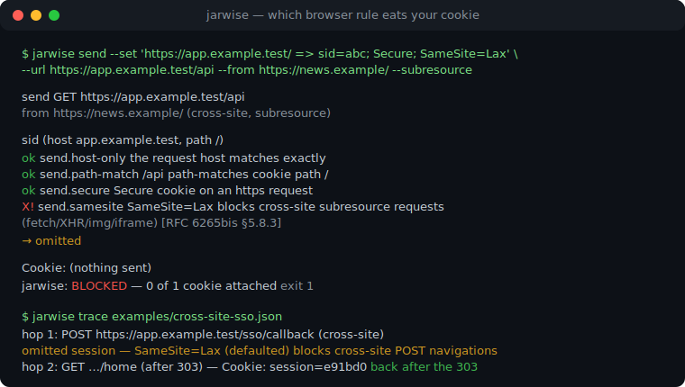
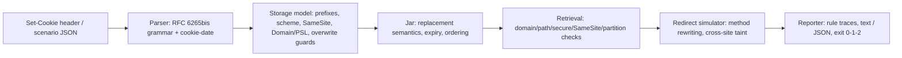

# jarwise

[English](README.md) | [中文](README.zh.md) | [日本語](README.ja.md)

[](LICENSE)   [](CONTRIBUTING.md)

**オープンソース・依存ゼロの Set-Cookie シミュレーター。SameSite・Secure・Domain スコープ・リダイレクト生存を解説——ヘッダーを貼り付ければ、どのブラウザールールが cookie を食べたのか正確に分かる。完全オフライン。**



```bash
# not yet on npm — install from a checkout of this repository
npm install && npm run build && npm pack
npm install -g ./jarwise-0.1.0.tgz
```

## なぜ jarwise？

Cookie は静かに失敗します。ブラウザーが Set-Cookie を破棄したり、リクエストから cookie を差し止めたりしても、サーバーにはヘッダーの欠落しか見えず、ユーザーにはログインループしか見えません。破棄を決めるルールは実在するのに散在しています——何年も前に変わったのにいまだに SSO コールバックを壊す SameSite の既定値、平文リダイレクト一跳びで消える `Secure` cookie、public suffix に阻まれて永遠にマッチしない `Domain` 値、`__Host-` 契約、非セキュア上書き保護、そして誰も覚えていない Path アルゴリズム。HTTP クライアントは cookie jar を内部に隠して*結果*だけを渡し、DevTools は事後に、一つのリクエストに、一つのブラウザーセッションでツールチップを見せるだけです。jarwise は RFC 6265bis の実アルゴリズム——パース、ストレージモデル、取得アルゴリズム、さらに内蔵 public suffix スナップショット上の schemeful same-site——を純粋で説明可能なシミュレーターとして実装します。あらゆる判定は名前付きチェックのトレースになり、合否、RFC の参照、平易な一文が付きます。ターミナルでオフラインに動き、メソッド書き換えやクロスサイト汚染を含むリダイレクトチェーン全体を再生し、終了コード 0/1/2 で「セッション cookie はログインフローを生き延びる」を CI が永続的に検証できます。

|  | jarwise | ブラウザー DevTools | tough-cookie | curl -b/-c |
|---|---|---|---|---|
| 目的 | 判定そのものを説明 | 生きたセッションを一度検査 | HTTP クライアント向け jar ライブラリ | クライアントに隠れた jar |
| cookie が落ちた/止められた*理由*を言う | 全ルール、RFC 参照付き | アイコン + 短いツールチップ | ブール値の結果 | 言わない |
| オフラインで動く、サーバー不要 | はい | 実フローが動いている必要 | 自分のコード内 | 実サーバーが必要 |
| SameSite / schemeful same-site シミュレーション | Strict/Lax/None + 既定 Lax | 実施のみ、説明なし | 部分的 | SameSite が皆無 |
| リダイレクトチェーン（303 と 307、汚染） | 第一級のシナリオ | 手でクリック | ループは自作 | 黙って追従 |
| public suffix / スーパー cookie 防御 | 内蔵スナップショット | あるが不透明 | 任意依存経由 | ない |
| cookie 生存を CI でゲート | 終了コード + `--expect` | 不可 | 手書きアサート | 壊れやすいスクリプト |
| ランタイム依存 | 0 | 対象外 | 4（2026-07、npm） | 対象外 |

<sub>各機能の注記は 2026-07 時点の各プロジェクト公開ドキュメントで確認。</sub>

## 特長

- **RFC がブラックボックスではなくトレースになる** —— ストレージも取得も一歩ずつ実行され、各チェックが自分の id、判定、RFC 6265bis 参照、同僚に読める一文を報告します（`X! send.samesite — SameSite=Lax blocks cross-site subresource requests`）。
- **4 コマンド、1 エンジン** —— `explain` は URL なしでヘッダーを注釈。`store` は「ブラウザーは保存する？」に、`send` は「このリクエストに乗る？」に答え、`trace` はリダイレクトチェーン全体をホップごとに再生します。
- **SameSite を正しく** —— Strict/Lax/None に加え、属性欠落時の Lax 既定（`defaulted` と明記）、トップレベルナビゲーションの安全メソッド例外、schemeful same-site、そして大半の人が忘れているクロスサイト*設定*制限。
- **リダイレクト生存という主役** —— 303 は POST を GET に書き換え 307 はしない、サブリソースチェーンは一度のクロスサイト跳躍で汚染され、Secure cookie は平文ホップを飛ばす。`--expect sid` でそのすべてが CI アサーションになります。
- **実世界のエッジへの忠実さ** —— 寛容な cookie-date パーサー（2 桁年、asctime）、`__Host-`/`__Secure-` プレフィックス、public suffix スーパー cookie 拒否、信頼できる `localhost`、HttpOnly と `document.cookie`、CHIPS `Partitioned` キー、削除セマンティクス。
- **CI のために、依存ゼロで** —— `--now` 注入時計の下で出力は決定的、`--format json` は安定形状、終了コード 0/1/2。要件は Node.js だけで、ツールはソケットを一切開きません。

## クイックスタート

インストール：

```bash
# not yet on npm — install from a checkout of this repository
npm install && npm run build && npm pack
npm install -g ./jarwise-0.1.0.tgz
```

あるヘッダーがなぜ絶望的か聞いてみる：

```bash
jarwise store 'sid=abc; SameSite=None' --url https://app.example.test/login
```

出力（実キャプチャ）：

```text
store https://app.example.test/login
  Set-Cookie: sid=abc; SameSite=None

  ok  store.prefix                 no __Secure-/__Host- prefix — no extra attribute contract applies  [RFC 6265bis §4.1.3]
  ok  store.secure-scheme          cookie is not Secure — no secure-origin requirement  [RFC 6265bis §5.7 step 8]
  X!  store.samesite-none-secure   SameSite=None without Secure is rejected outright by modern browsers  [RFC 6265bis §5.7 step 12]

jarwise: REJECTED — SameSite=None without Secure is rejected outright by modern browsers
```

終了コード 1——このヘッダーはどの jar にも入りませんでした。続いて古典的な SSO ログインループをシナリオファイルで（`examples/cross-site-sso.json`：IdP がコールバックへ POST するが、セッション cookie に SameSite 属性がない）。実キャプチャ：

```bash
jarwise trace examples/cross-site-sso.json
```

```text
trace: navigation, initiated from https://idp.example/

hop 1: POST https://app.example.test/sso/callback (cross-site)
  Cookie: (nothing sent)
    omitted session (host app.example.test, path /) — SameSite=Lax (defaulted — no SameSite attribute) blocks cross-site POST navigations — Lax only allows safe methods (GET/HEAD/OPTIONS/TRACE) [RFC 6265bis §5.8.3]

hop 2: GET https://app.example.test/home (cross-site)
  Cookie: session=e91bd0

final jar: session (host app.example.test, path /)
expect session: sent on the final hop
jarwise: OK — the chain behaves as expected
```

コールバックは未ログイン状態で到着し、303 がチェーンを GET に変えると cookie が戻ってくる——バグ全体が一画面に。その他のシナリオ（`__Host-` ログインフロー、Secure cookie を食べる https→http ダウングレード、CI ゲートスクリプト）は [examples/](examples/README.md) にあります。

## コマンドと終了コード

`explain` はヘッダーだけで動作。`store` は設定 URL を加え（`--from`・`--subresource`・`--api script` で文脈を精密化）、`send` は `--set '<url> => <header>'` ペアで jar を種付けして一つのリクエストを問い、`trace` は JSON シナリオを再生します（[フォーマット参照](docs/trace-format.md)）。全チェック id は [docs/rules.md](docs/rules.md) に記載。

| フラグ | 既定 | 効果 |
|---|---|---|
| `--format text\|json` | `text` | 人間向けトレース、または CI 向け安定 JSON 形状 |
| `--now <ISO 8601>` | 実時刻 | 時計を固定：期限計算が再現可能に |
| `--from <url\|address-bar>` | `address-bar` | リクエスト発起元。same-site 計算を駆動 |
| `--subresource` | オフ | トップレベルナビゲーションでなく fetch/XHR/img 文脈 |
| `--method <verb>` | `GET` | リクエストメソッド（Lax が気にする。trace では 303 が GET に書き換え、307 は保持） |
| `--set '<url> => <header>'` | — | send の jar を種付け。繰り返し可 |
| `--expect <name>` | — | この cookie が添付されたかで終了コードをゲート。繰り返し可 |
| `--api http\|script` | `http` | Set-Cookie の出所：レスポンスヘッダーか `document.cookie` か |

終了コード：`0` 保存/添付/期待をすべて満たす、`1` ブラウザールールが cookie を拒否または差し止め、`2` 用法・入力エラー——パイプラインは「cookie が壊れた」と「コマンドを間違えた」を区別できます。

## アーキテクチャ



## ロードマップ

- [x] Set-Cookie パーサー、ルールトレース付きストレージ + 取得モデル、内蔵 PSL スナップショット上の schemeful same-site、リダイレクトチェーンシミュレーター、CLI 4 コマンド、JSON 出力（v0.1.0）
- [ ] `--psl <file>`：内蔵スナップショットの代わりに完全な public suffix リストを読み込む
- [ ] Chrome の 2 分間 "Lax-allowing-unsafe"（Lax+POST）猶予ウィンドウのシミュレーション
- [ ] `jarwise diff`：二つの Set-Cookie ヘッダーを比較し挙動差を説明
- [ ] HAR インポート：キャプチャ済みブラウザーセッションをシミュレーターで再生
- [ ] ブラウザープロファイル：ルールセット切り替え（例：Firefox Total Cookie Protection の分割）

全リストは [open issues](https://github.com/JaydenCJ/jarwise/issues) を参照。

## コントリビュート

コントリビュート歓迎です。`npm install && npm run build` でビルドし、`npm test`（90 テスト）と `bash scripts/smoke.sh`（`SMOKE OK` を出力すること）を実行してください——このリポジトリは CI を持たず、上記の主張はすべてローカル実行で検証されています。[CONTRIBUTING.md](CONTRIBUTING.md) を読み、[good first issue](https://github.com/JaydenCJ/jarwise/issues?q=is%3Aissue+is%3Aopen+label%3A%22good+first+issue%22) を掴むか、[discussion](https://github.com/JaydenCJ/jarwise/discussions) を始めてください。

## ライセンス

[MIT](LICENSE)
