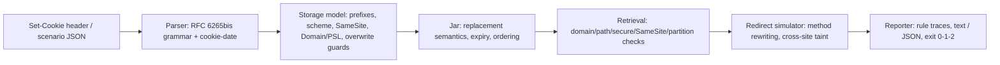

# jarwise

[English](README.md) | [中文](README.zh.md) | [日本語](README.ja.md)

[](LICENSE)   [](CONTRIBUTING.md)

**An open-source, zero-dependency Set-Cookie simulator that explains SameSite, Secure, Domain scoping and redirect survival — paste a header in and learn exactly which browser rule eats your cookie, fully offline.**


```bash
# not yet on npm — install from a checkout of this repository
npm install && npm run build && npm pack
npm install -g ./jarwise-0.1.0.tgz
```

## Why jarwise?

Cookies fail silently: the browser drops a Set-Cookie or withholds a cookie from a request, the server just sees a missing header, and the user sees a login loop. The rules doing the dropping are real but scattered — SameSite defaults that changed years ago and still break SSO callbacks, `Secure` cookies that vanish on one plaintext redirect hop, `Domain` values that never match because a public suffix is in the way, `__Host-` contracts, insecure-overwrite protection, and a Path algorithm nobody remembers. HTTP clients hide a cookie jar inside themselves and give you the *outcome*; DevTools shows you a tooltip after the fact, on one request, in one browser session. jarwise implements the actual algorithms of RFC 6265bis — parsing, the storage model, the retrieval algorithm, plus schemeful same-site over an embedded public-suffix snapshot — as a pure, explainable simulator: every decision is a trace of named checks with pass/fail, the RFC reference, and a plain-English sentence. It runs offline in your terminal, replays whole redirect chains including method rewriting and cross-site taint, and exits 0/1/2 so CI can assert "the session cookie survives our login flow" forever.

|  | jarwise | browser DevTools | tough-cookie | curl -b/-c |
|---|---|---|---|---|
| Purpose | explain the decision | inspect one live session | jar library for HTTP clients | jar hidden in a client |
| Says *why* a cookie was dropped/withheld | every rule, with RFC refs | icon + short tooltip | boolean result | no |
| Works offline, no server needed | yes | needs the real flow running | in your code | needs the real server |
| SameSite / schemeful same-site simulation | Strict/Lax/None + defaulted-Lax | enforced, not explained | partial | no SameSite at all |
| Redirect chains (303 vs 307, taint) | first-class scenarios | manual clicking | you write the loop | follows, silently |
| Public-suffix / supercookie guard | embedded snapshot | yes, opaque | via optional dep | no |
| CI gate on cookie survival | exit codes + `--expect` | no | hand-rolled asserts | fragile scripting |
| Runtime dependencies | 0 | n/a | 4 (2026-07, npm) | n/a |

<sub>Capability notes checked against each project's public documentation, 2026-07.</sub>

## Features

- **The RFC as a trace, not a black box** — storage and retrieval run step by step; every check reports its id, verdict, RFC 6265bis reference, and a sentence a teammate can read (`X! send.samesite — SameSite=Lax blocks cross-site subresource requests`).
- **Four commands, one engine** — `explain` annotates a header with no URL needed; `store` answers "would a browser keep this?"; `send` answers "does it ride this request?"; `trace` replays an entire redirect chain hop by hop.
- **SameSite done properly** — Strict/Lax/None plus the absent-attribute Lax default (labelled `defaulted`), safe-method exceptions for top-level navigations, schemeful same-site, and the cross-site *setting* restriction most people forget exists.
- **Redirect survival, the headline act** — 303 rewrites POST to GET while 307 does not, subresource chains are tainted by one cross-site bounce, Secure cookies skip plaintext hops; `--expect sid` turns any of it into a CI assertion.
- **Real-world edge fidelity** — the forgiving cookie-date parser (two-digit years, asctime), `__Host-`/`__Secure-` prefixes, public-suffix supercookie rejection, trustworthy `localhost`, HttpOnly vs `document.cookie`, CHIPS `Partitioned` keys, deletion semantics.
- **Built for CI, zero dependencies** — deterministic output under an injected `--now` clock, `--format json` with a stable shape, exit codes 0/1/2; Node.js is the only requirement and the tool never opens a socket.

## Quickstart

Install:

```bash
# not yet on npm — install from a checkout of this repository
npm install && npm run build && npm pack
npm install -g ./jarwise-0.1.0.tgz
```

Ask why a header is doomed:

```bash
jarwise store 'sid=abc; SameSite=None' --url https://app.example.test/login
```

Output (real captured run):

```text
store https://app.example.test/login
  Set-Cookie: sid=abc; SameSite=None

  ok  store.prefix                 no __Secure-/__Host- prefix — no extra attribute contract applies  [RFC 6265bis §4.1.3]
  ok  store.secure-scheme          cookie is not Secure — no secure-origin requirement  [RFC 6265bis §5.7 step 8]
  X!  store.samesite-none-secure   SameSite=None without Secure is rejected outright by modern browsers  [RFC 6265bis §5.7 step 12]

jarwise: REJECTED — SameSite=None without Secure is rejected outright by modern browsers
```

Exit code 1 — the header never made it into any jar. Now the classic SSO login loop, as a scenario file (`examples/cross-site-sso.json`: an IdP POSTs back to your callback while the session cookie has no SameSite attribute). Real captured run:

```bash
jarwise trace examples/cross-site-sso.json
```

```text
trace: navigation, initiated from https://idp.example/

hop 1: POST https://app.example.test/sso/callback (cross-site)
  Cookie: (nothing sent)
    omitted session (host app.example.test, path /) — SameSite=Lax (defaulted — no SameSite attribute) blocks cross-site POST navigations — Lax only allows safe methods (GET/HEAD/OPTIONS/TRACE) [RFC 6265bis §5.8.3]

hop 2: GET https://app.example.test/home (cross-site)
  Cookie: session=e91bd0

final jar: session (host app.example.test, path /)
expect session: sent on the final hop
jarwise: OK — the chain behaves as expected
```

The callback arrives logged out; the 303 turns the chain into a GET and the cookie comes back — the whole bug in one screen. More scenarios (a `__Host-` login flow, an https→http downgrade that eats a Secure cookie, a CI gate script) live in [examples/](examples/README.md).

## Commands and exit codes

`explain` needs only the header; `store` adds the setting URL (`--from`, `--subresource`, `--api script` refine the context); `send` seeds a jar with `--set '<url> => <header>'` pairs and asks about one request; `trace` replays a JSON scenario ([format reference](docs/trace-format.md)). Every check id is documented in [docs/rules.md](docs/rules.md).

| Flag | Default | Effect |
|---|---|---|
| `--format text\|json` | `text` | human trace or a stable JSON shape for CI |
| `--now <ISO 8601>` | real time | pin the clock: expiry math becomes reproducible |
| `--from <url\|address-bar>` | `address-bar` | request initiator; drives same-site computation |
| `--subresource` | off | fetch/XHR/img context instead of a top-level navigation |
| `--method <verb>` | `GET` | request method (Lax cares; in traces a 303 rewrites it to GET, a 307 keeps it) |
| `--set '<url> => <header>'` | — | seed the send jar; repeatable |
| `--expect <name>` | — | gate the exit code on this cookie being attached; repeatable |
| `--api http\|script` | `http` | Set-Cookie via response header or `document.cookie` |

Exit codes: `0` stored/attached/expectations met, `1` a browser rule rejected or withheld a cookie, `2` usage or input error — so a pipeline can tell a broken cookie from a broken invocation.

## Architecture



## Roadmap

- [x] Set-Cookie parser, storage + retrieval models with rule traces, schemeful same-site over an embedded PSL snapshot, redirect-chain simulator, four CLI commands, JSON output (v0.1.0)
- [ ] `--psl <file>`: load a full public-suffix list instead of the embedded snapshot
- [ ] Simulate Chrome's two-minute "Lax-allowing-unsafe" (Lax+POST) grace window
- [ ] `jarwise diff`: compare two Set-Cookie headers and explain the behavioral delta
- [ ] HAR import: replay a captured browser session through the simulator
- [ ] Browser profiles: toggle rule sets (e.g. Firefox Total Cookie Protection partitioning)

See the [open issues](https://github.com/JaydenCJ/jarwise/issues) for the full list.

## Contributing

Contributions are welcome. Build with `npm install && npm run build`, then run `npm test` (90 tests) and `bash scripts/smoke.sh` (must print `SMOKE OK`) — this repository ships no CI, every claim above is verified by local runs. See [CONTRIBUTING.md](CONTRIBUTING.md), grab a [good first issue](https://github.com/JaydenCJ/jarwise/issues?q=is%3Aissue+is%3Aopen+label%3A%22good+first+issue%22), or start a [discussion](https://github.com/JaydenCJ/jarwise/discussions).

## License

[MIT](LICENSE)
