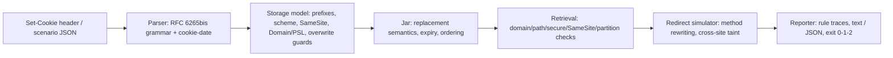

# jarwise

[English](README.md) | [中文](README.zh.md) | [日本語](README.ja.md)

[](LICENSE)   [](CONTRIBUTING.md)

**开源、零依赖的 Set-Cookie 模拟器：解释 SameSite、Secure、Domain 作用域与重定向存活——把 header 粘进来，精确了解是哪条浏览器规则吃掉了你的 cookie，完全离线。**


```bash
# not yet on npm — install from a checkout of this repository
npm install && npm run build && npm pack
npm install -g ./jarwise-0.1.0.tgz
```

## 为什么选 jarwise？

Cookie 的失败是无声的：浏览器丢弃某个 Set-Cookie，或在请求里扣下某个 cookie，服务器只看到 header 缺失，用户只看到登录死循环。做出丢弃决定的规则真实存在却四处分散——多年前就变更、至今仍弄坏 SSO 回调的 SameSite 默认值，在一跳明文重定向上消失的 `Secure` cookie，因公共后缀挡路而永远匹配不上的 `Domain` 值，`__Host-` 契约，不安全覆盖保护，还有没人记得清的 Path 算法。HTTP 客户端把 cookie jar 藏在内部，只给你*结果*；DevTools 只在事后、只对一个请求、只在一次浏览器会话里给你一个 tooltip。jarwise 把 RFC 6265bis 的真实算法——解析、存储模型、检索算法，外加基于内嵌公共后缀快照的 schemeful same-site——实现为纯粹、可解释的模拟器：每个决定都是一条具名检查的轨迹，带通过/失败、RFC 出处和一句大白话说明。它在终端离线运行，可回放包含方法改写与跨站污染的完整重定向链，并以 0/1/2 退出码让 CI 永久断言"会话 cookie 能活过我们的登录流程"。

|  | jarwise | 浏览器 DevTools | tough-cookie | curl -b/-c |
|---|---|---|---|---|
| 定位 | 解释决定本身 | 检查一次线上会话 | 供 HTTP 客户端用的 jar 库 | 藏在客户端里的 jar |
| 说明 cookie 被丢/被扣的*原因* | 每条规则，附 RFC 出处 | 图标 + 简短 tooltip | 布尔结果 | 不说明 |
| 离线可用，无需服务器 | 是 | 需要真实流程在跑 | 在你的代码里 | 需要真实服务器 |
| SameSite / schemeful same-site 模拟 | Strict/Lax/None + 默认 Lax | 只执行，不解释 | 部分 | 完全没有 SameSite |
| 重定向链（303 与 307、污染） | 一等公民的场景文件 | 手动点击 | 循环得自己写 | 静默跟随 |
| 公共后缀 / 超级 cookie 防护 | 内嵌快照 | 有但不透明 | 依赖可选包 | 没有 |
| 用 CI 卡住 cookie 存活 | 退出码 + `--expect` | 不行 | 手写断言 | 脆弱的脚本 |
| 运行时依赖 | 0 | 不适用 | 4（2026-07，npm） | 不适用 |

<sub>各项能力说明依据各项目 2026-07 时的公开文档核对。</sub>

## 特性

- **RFC 变成轨迹，而不是黑箱** —— 存储与检索逐步执行；每条检查报告自己的 id、判定、RFC 6265bis 出处，以及一句同事能看懂的话（`X! send.samesite — SameSite=Lax blocks cross-site subresource requests`）。
- **四个命令，一套引擎** —— `explain` 无需 URL 即可注解 header；`store` 回答"浏览器会留下它吗？"；`send` 回答"它会随这个请求发出吗？"；`trace` 逐跳回放整条重定向链。
- **把 SameSite 做对** —— Strict/Lax/None，加上属性缺失时的 Lax 默认（标注 `defaulted`）、顶级导航的安全方法豁免、schemeful same-site，以及多数人忘了存在的跨站*设置*限制。
- **重定向存活，压轴主角** —— 303 把 POST 改写为 GET 而 307 不会，子资源链被一次跨站弹跳污染，Secure cookie 跳过明文跳数；`--expect sid` 能把这一切变成 CI 断言。
- **真实世界的边角保真** —— 宽容的 cookie-date 解析器（两位年份、asctime）、`__Host-`/`__Secure-` 前缀、公共后缀超级 cookie 拒绝、可信的 `localhost`、HttpOnly 对 `document.cookie`、CHIPS `Partitioned` 分区键、删除语义。
- **为 CI 而生，零依赖** —— 注入 `--now` 时钟后输出完全确定，`--format json` 形状稳定，退出码 0/1/2；唯一要求是 Node.js，工具从不打开任何 socket。

## 快速上手

安装：

```bash
# not yet on npm — install from a checkout of this repository
npm install && npm run build && npm pack
npm install -g ./jarwise-0.1.0.tgz
```

问问某个 header 为什么注定失败：

```bash
jarwise store 'sid=abc; SameSite=None' --url https://app.example.test/login
```

输出（真实运行记录）：

```text
store https://app.example.test/login
  Set-Cookie: sid=abc; SameSite=None

  ok  store.prefix                 no __Secure-/__Host- prefix — no extra attribute contract applies  [RFC 6265bis §4.1.3]
  ok  store.secure-scheme          cookie is not Secure — no secure-origin requirement  [RFC 6265bis §5.7 step 8]
  X!  store.samesite-none-secure   SameSite=None without Secure is rejected outright by modern browsers  [RFC 6265bis §5.7 step 12]

jarwise: REJECTED — SameSite=None without Secure is rejected outright by modern browsers
```

退出码 1——这个 header 从未进入任何 jar。接着是经典的 SSO 登录死循环，写成场景文件（`examples/cross-site-sso.json`：IdP 向你的回调 POST，而会话 cookie 没有 SameSite 属性）。真实运行记录：

```bash
jarwise trace examples/cross-site-sso.json
```

```text
trace: navigation, initiated from https://idp.example/

hop 1: POST https://app.example.test/sso/callback (cross-site)
  Cookie: (nothing sent)
    omitted session (host app.example.test, path /) — SameSite=Lax (defaulted — no SameSite attribute) blocks cross-site POST navigations — Lax only allows safe methods (GET/HEAD/OPTIONS/TRACE) [RFC 6265bis §5.8.3]

hop 2: GET https://app.example.test/home (cross-site)
  Cookie: session=e91bd0

final jar: session (host app.example.test, path /)
expect session: sent on the final hop
jarwise: OK — the chain behaves as expected
```

回调到达时是未登录状态；303 把链变成 GET，cookie 又回来了——整个 bug 一屏看完。更多场景（`__Host-` 登录流程、吃掉 Secure cookie 的 https→http 降级、CI 门禁脚本）见 [examples/](examples/README.md)。

## 命令与退出码

`explain` 只需要 header；`store` 加上设置 URL（`--from`、`--subresource`、`--api script` 细化上下文）；`send` 用 `--set '<url> => <header>'` 播种 jar 并询问一个请求；`trace` 回放 JSON 场景（[格式参考](docs/trace-format.md)）。全部检查 id 记录在 [docs/rules.md](docs/rules.md)。

| 参数 | 默认 | 效果 |
|---|---|---|
| `--format text\|json` | `text` | 人读轨迹，或供 CI 用的稳定 JSON 形状 |
| `--now <ISO 8601>` | 真实时间 | 钉住时钟：过期计算可复现 |
| `--from <url\|address-bar>` | `address-bar` | 请求发起方；驱动 same-site 计算 |
| `--subresource` | 关 | fetch/XHR/img 上下文，而非顶级导航 |
| `--method <verb>` | `GET` | 请求方法（Lax 在意它；trace 里 303 会把它改写成 GET，307 保持不变） |
| `--set '<url> => <header>'` | — | 为 send 播种 jar；可重复 |
| `--expect <name>` | — | 以该 cookie 是否被附带作为退出码门禁；可重复 |
| `--api http\|script` | `http` | Set-Cookie 来自响应头还是 `document.cookie` |

退出码：`0` 已存储/已附带/期望全部满足，`1` 某条浏览器规则拒绝或扣下了 cookie，`2` 用法或输入错误——流水线因此能区分"cookie 坏了"和"命令敲错了"。

## 架构



## 路线图

- [x] Set-Cookie 解析器、带规则轨迹的存储 + 检索模型、基于内嵌 PSL 快照的 schemeful same-site、重定向链模拟器、四个 CLI 命令、JSON 输出（v0.1.0）
- [ ] `--psl <file>`：加载完整公共后缀列表以替代内嵌快照
- [ ] 模拟 Chrome 两分钟的 "Lax-allowing-unsafe"（Lax+POST）宽限窗口
- [ ] `jarwise diff`：比较两个 Set-Cookie header 并解释行为差异
- [ ] HAR 导入：把抓下来的浏览器会话回放进模拟器
- [ ] 浏览器画像：切换规则集（如 Firefox Total Cookie Protection 分区）

完整列表见 [open issues](https://github.com/JaydenCJ/jarwise/issues)。

## 参与贡献

欢迎贡献。用 `npm install && npm run build` 构建，然后跑 `npm test`（90 个测试）和 `bash scripts/smoke.sh`（必须打印 `SMOKE OK`）——本仓库不带 CI，以上每条声明都由本地运行验证。参见 [CONTRIBUTING.md](CONTRIBUTING.md)，认领一个 [good first issue](https://github.com/JaydenCJ/jarwise/issues?q=is%3Aissue+is%3Aopen+label%3A%22good+first+issue%22)，或发起一个 [discussion](https://github.com/JaydenCJ/jarwise/discussions)。

## 许可证

[MIT](LICENSE)
